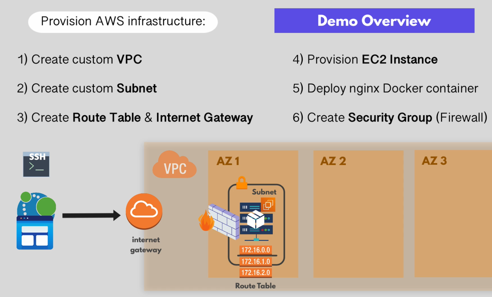

## About
---------------------------------------
- Provision an EC2 instance
    + Create own VPC
    + Create subnet
    + Create Security group
    + Create route table
    + Connect this VPC to IGW
    + Deploy EC2 in this subnet
- Run a nginx docker container on this EC2 instance

