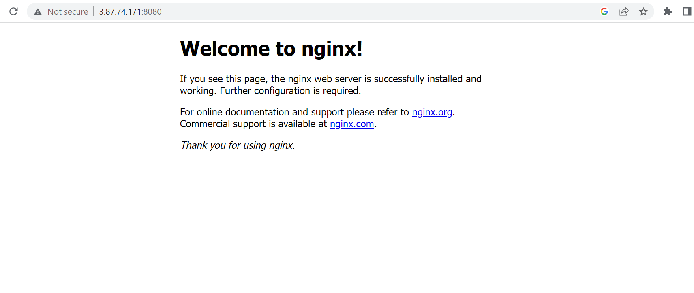

## About
---------------------------------------
- Provision an EC2 instance
    + Create own VPC
    + Create subnet
    + Create Security group
    + Create route table
    + Connect this VPC to IGW
    + Deploy EC2 in this subnet
- Run a nginx docker container on this EC2 instance

### Steps
--------------------------
- Created VPC > Subnet > IGW > Route table > subnet association with route table
- Create Security Group and allow access po ports:
    + SSH - 22
    + HTTP - 80
    + HTTPS - 443
+ key-pair dynamic resource

