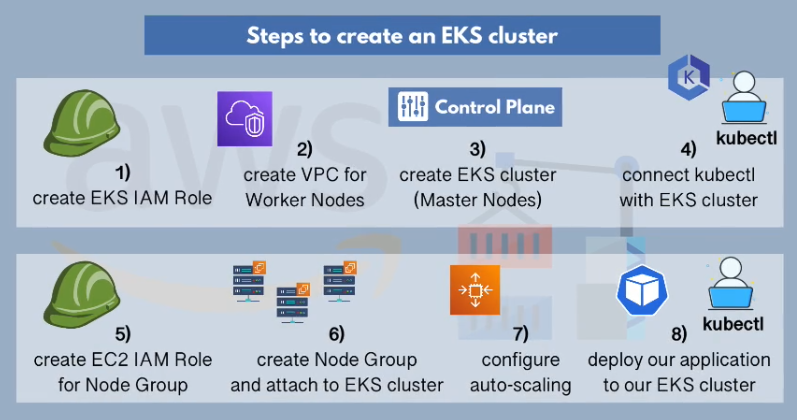
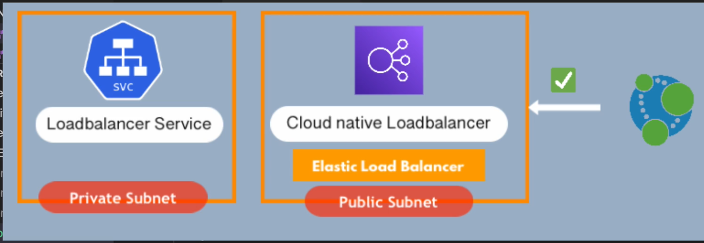

## Project- EKS Cluster
-----------------------------

### Steps
-------------------------
- Create EKS IAM role
- Create VPC for worker node
- Create master node
- Connect kubectl with EKS cluster
- Create EC2 role for worker node
- Create worker node and attach to EKS cluster
- Configure auto-scaling
- Deploy application to EKS cluster

- Create 1 private & 1 public subnet in each AZ of a region

+ Note: VPC tag, subnets tags helps to manage cluster

